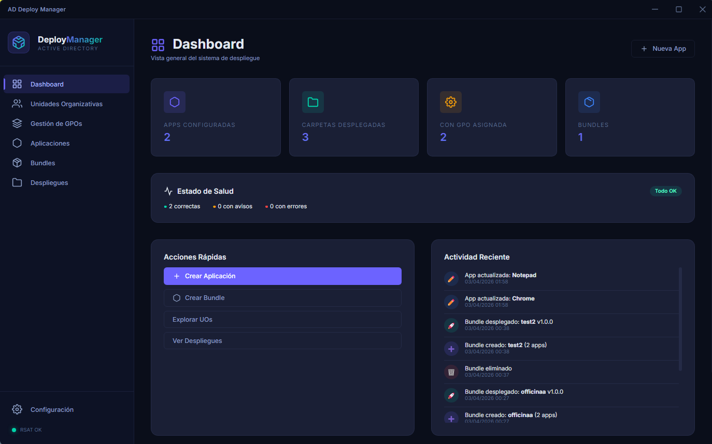

# AppDeploy Manager

<div align="center">
  
</div>

**AppDeploy Manager** es una poderosa aplicación diseñada para SysAdmins y equipos de TI. Permite desplegar software de manera desatendida ("Drop & Run") utilizando las directivas de Active Directory (GPOs). A través de una interfaz moderna y unificada, puedes asignar ejecutables o MSIs automatizados directamente en las Unidades Organizativas (OUs) de tu compañía.

## 🚀 Características Principales

- **Interfaz Gráfica de AD:** Explora tus Unidades Organizativas (OUs) y visualiza exactamente qué aplicaciones se están desplegando a través de tus GPOs.
- **Catálogo Corporativo de Plantillas:** Despliega software complejo con 1 clic. Incluye plantillas autogenerables para:
  - *Seguridad*: Wazuh, SentinelOne, Cortex XDR, Bitdefender, CrowdStrike Falcon.
  - *Conectividad*: GlobalProtect, Zscaler, FortiClient, Cisco Secure Client.
  - *Soporte & RMM*: TeamViewer, AnyDesk, Lansweeper, NinjaOne, Freshservice.
  - *Endpoints*: Microsoft Office, SAP GUI, Chrome Enterprise y Custom scripts (Raw PowerShell).
- **Control de Logs & Caching:** Cada AppDeploy generado incluye lógica PSScripts que descarga el software al disco duro (`C:\Temp\Deploy`) primero, y además guarda tokens de "ya instalado" para prevenir repetidos despliegues si la GPO se vuelve a lanzar.
- **Alertas Visuales Locales (User Toast):** El sistema levanta notificaciones nativas de Windows directamente conectadas a la *Session 0* para avisar al usuario final de que una instalación corporativa se está llevando a cabo.
- **Internacionalización y Asistente (Setup):** Setup configurable en el primer arranque para rutear tu `Red de Share` y soporte multi-idioma nativo.

## ⚙️ Requisitos Previos

- Entorno **Windows** (Preferiblemente Windows 10 / 11 / Server 2016+).
- Máquina conectada a un Dominio de **Active Directory** con privilegios administrativos (Domain Admin para la creación de GPOs).
- Herramientas RSAT de Active Directory instaladas localmente (el programa las verificará y te guiará para instalarlas si te faltan).
- **Node.js** (solo para modo desarrollador/compilación).

## 🛠️ Instalación y Compilación Local

Si deseas correr la aplicación nativamente desde el código fuente o compilar tu propio ejecutable:

1. Clona el repositorio e instala las dependencias:
   ```bash
   git clone https://github.com/gpandres/ActiveDirectoryDeployManager
   cd ActiveDirectoryDeployManager
   npm install
   ```

2. Ejecuta la aplicación en modo desarrollo:
   ```bash
   npm start
   ```

3. Compila a ejecutable:
   ```bash
   npm run build
   ```
   *(También puedes utilizar `npm run build:portable` si configuraste webpack/electron-builder).*

## 📖 Arquitectura y Cómo Funciona

1. Seleccionas un `.EXE` o `.MSI` local y rellenas su plantilla.
2. AppDeploy copia el instalador a tu ruta compartida (`\\Servidor\Share`).
3. Se autogenera un `install.ps1` maestro y se inyecta en la GPO.
4. El AD asocia el script a los ordenadores de la OU.
5. Al reiniciar los equipos, evalúan el `install.ps1` y ejecutan tu despliegue de forma distribuida en bloque.

---

> AppDeploy Manager ha sido construido utilizando **Electron.js** acoplado al subsistema nativo de terminal de PowerShell. No posee integraciones Cloud, todo sucede en control total de tus redes internas.
